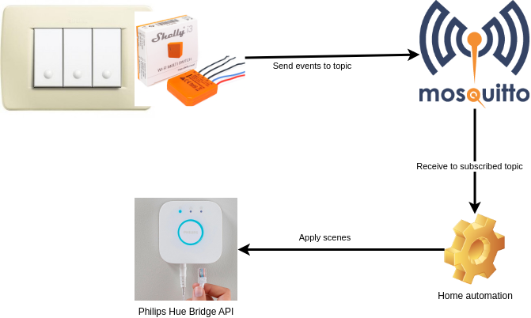

# Home Automation

This application allows to use "classic" light switches to control Philips HUE lights, connected through a Philips HUE Bridge.

## About the project

### Why?

Smart lights should always be powered, to be controlled through the Hue app.
So what we can do with the old light switches? We can convert the "physical light switch" into a "logical light switch", that calls HUE API to set a scene.
Respect to other systems, like home-assistant, we can create customized actions, like, for push buttons, keep the button pushed and carousel scenes, and keep the scene when you release the button.

### How?
- Bypass physical light switch to always power lights, and connect the physical switch to shelly i3, that allows to "virtualize" switchs by sending via Wifi events about push and release light switch.
- Obtain Hue Bridge API username (https://developers.meethue.com/develop/get-started-2/)
- Install this software via docker-compose on an always-on host (like Raspberry Pi)

### Design

- Use Mosquitto as MQTT broker.
- Shelly i3, with MQTT protocol enabled, points to the Mosquitto instance, and sends event when the light switch change state.
- Home-automation app will subscribe to Mosquitto, waiting for switch events. Based on events, it will call Philips Hue Bridge Hub API to set scenes, based on app configuration.

## Build (optional)
You can customize, compile and create artifact for the project. In this case you need nodeJS >= 16 installed on your laptop.
From main project folder, run:

        npm run-script build
        npm pack --pack-destination="artifact"

The file artifact/home-automation-1.0.0.tgz will be created, and it's ready to be deployed.

## Deploy the artifact (on linux system)
- Download artifact/home-automation-1.0.0.tgz into a base folder.
- Untar the archive.
- Copy script `package/script/install.sh` to base folder.
- Execute `install.sh` to set up default configuration, or do it manually by following next steps [here](#mosquitto).
- Edit `/srv/services/home-automation/config.json` to specify MQTT broker access, Philips Hue Bridge API access and button configuration (see [here](#htconf)).
- Start the application with command `docker-compose -f package/docker-compose.yml up -d --build`.
- Set mosquitto credential by following instructions [here](#mosquitto_pwd).

### Mosquitto 

This is an instance of eclipse-mosquitto docker image, with custom configuration.
On deploy, mosquitto folders are mapped to the following folders; make sure that these folders exists:
- `/srv/services/mosquitto/config`: should contains mosquitto.conf and passwords file, referenced by mosquitto.conf.
- `/srv/services/mosquitto/log`: contains logs.
- `/srv/services/mosquitto/data`: persist data when mosquitto shut down.

Copy these files in `docker/mosquitto` to `/srv/services/mosquitto/config` before deploy:
- **mosquitto.conf:** specify the configuration, by enabling persistence, disable anonymous users, and specify credentials files
- **passwords:** specify the user and the password allowed to connect to MQTT broker.

<h4 id="mosquitto_pwd"></h4>
After deploy, just use the command
        
        docker exec -it mosquitto-instance sh
        mosquitto_passwd -b -c /mosquitto/config/passwords MOSQUITTO_USERNAME MOSQUITTO_PASSWORD

### Home-automation
This is a NodeJS image that includes the home-automation code, install the package, and run the nodeJS entry-point.
You need to specify the configuration files (that contains also MQTT address and credentials, and HUE API credentials) via volume mapping.
In docker compose we expect the configuration file at `/srv/services/home-automation/config.json`; make sure that it exists; otherwise copy and edit it from `src/config/config.json`.

<h4 id="htconf"><strong>configuration file</strong></h4>

Update configuration file to set:
- MQTT_BROKER: mqtt://\<ip address where code is deployed\>.
- MQTT_USER: set to MOSQUITTO_USERNAME, specified in mosquitto config.
- MQTT_PWD: set to MOSQUITTO_PASSWORD, specified in mosquitto config.
- HUE_BRIDGE: set to IP address of Hue bridge, like "192.168.1.5".
- HUE_USER: set it to the Hue API username, generated with these steps (https://developers.meethue.com/develop/get-started-2/).

Set automation handlers; two types of handler are available; `toggle` to handle toggle light switch, and `carousel` to handle push light switch.

- toggle:

        {
            "handler_name": "bath-ext",
            "handler_type": "toggle",
            "mqtt_topic": "shellies/<i3 mqtt prefix>/input/0",
            "light_group_name": "bathroom",
            "scene_default": "default"
        }

we need to set the unique name, the type, the mqtt topic that will be set on shelly i3 configuration, the light group name to control, and the scene to enable when the light switch change state.

- carousel:

        {
            "handler_name": "bath-ext",
            "handler_type": "carousel",
            "mqtt_topic": "shellies/<i3 mqtt prefix>/input/0",
            "light_group_name": "bathroom",
            "scene_template": ["shower*"],
            "scene_default": "default",
            "overrides":{
                "carousel_time": 1000,
                "short_click": 500,
                "consecutive_click_time":2000
            }
        }

This handler at first push it will turn on the default scene, and on the second click it will turn off the light. scene_template identifies a set of scenes (using * at start or at the end) that will be changed every carousel_time milliseconds, until the button will be released.

### Shelly i3
 - After physical setup and connection to local wlan, check your router configuration to discover its IP address.
 - Connect via browser to IP address, then click on `Internet Security`, `advanced - developer settings`.
 - Check `Enable MQTT`, set MOSQUITTO_USERNAME, MOSQUITTO_PASSWORD, mosquitto IP address and port.
 - Enable `Use custom MQTT prefix` and set name of the light switch; it will be used as part of topic name, to identify the source of the event.
